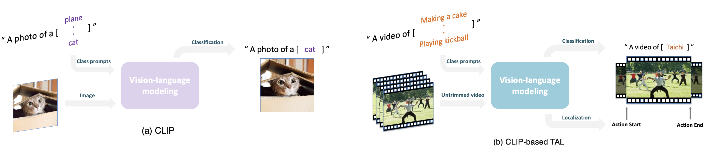

<div align="center">

<h1>Efficient Temporal Action Localization via Vision-Language Modelling</h1>

<h3>An Empirical Study on the STALE Model's Efficiency and Generalizability in Resource-constrained Environments</h3>

<div>
    Yunhan Wang<sup></sup>&emsp;
</div>

<div>
    <sup></sup>Computer Vision Lab, Delft University of Technology
</div>

</div>

# Abstract

Temporal Action Localization (TAL) aims to localize the start and end times of actions in untrimmed videos and classify the corresponding action types. TAL plays an important role in understanding video. Existing TAL approaches heavily rely on deep learning and require large-scale data and expensive training processes. Recent advances in Contrastive Language-Image Pre-Training (CLIP) have brought vision-language modeling into the field of TAL. While current CLIP-based TAL methods have been proven to be effective, their capabilities under data and compute-limited settings are not explored. In this paper, we have investigated the data and compute efficiencies of the CLIP-based STALE model. We evaluate the model performances under data-limited open/close-set scenarios. We find that STALE can demonstrate adequate generalizability using limited data. We experimented with the training time, inference time, GPU utilization, MACs, and memory consumption of STALE by inputting with varying video lengths. We discover an optimal input length for STALE to inference. Using model quantization, we find a significant forward time reduction for STALE on a single CPU. Our findings shed light on the capabilities and limitations of CLIP-based TAL methods under constrained data and compute resources. The insights gained from this research contribute to enhancing the efficiency and applicability of CLIP-based TAL techniques in real-world scenarios. The results provide valuable guidance for future advancements in CLIP-based TAL models and their potential for broader adoption in resource-constrained environments.


<br/>

# Main Modelling Idea


Illustration of the CLIP model (a) and a one-stage pipeline for CLIP-based TAL (b). The classes are treated as textual prompts and are trained to pair with vision instances. In (b), the outputs are the action class and action start/end time for each action instance in each untrimmed video.

<br/>


# Getting Started

## Installation
Please navigate to one of subfolders named STALE_* and see the readme file for installing Python packages.
We recommend Python >= 3.8, Pytorch = 1.9, CUDA = 10.2 for compatibility.

Pytorch-CUDA installation:
```
pip install torch==1.9.0+cu111 torchvision==0.10.0+cu111 torchaudio==0.9.0 -f https://download.pytorch.org/whl/torch_stable.html
```

## Data
Please refer to the aforementioned readme file to download CLIP pre-processed video features from ActivityNet, the data is stored on Google drive. Please specify the data path in **config/anet.yaml**.

If you would like to download the data from Google drive to your remote machine using `wget`, please check out this [tutorial](https://medium.com/@acpanjan/download-google-drive-files-using-wget-3c2c025a8b99).

<br/>

# Train

## Data-limited closed-set scenario
In the anno_files subfolder, there are annotation files for runing data limited experiments. *"anet_anno_action_50p1.json"* means the first subset with about 50% of the original training data. *"anet_anno_action_20p5.json"* means the fifth subset with about 20% of the original training data. There are five files for each data amount since we repeat experiments five times. Subsets are sampled uniformly using different random seeds.

Please navigate to STALE_closed, and place the annotation file you would like to use in **data/activitynet_annotations**.

Then run:
```
python stale_train.py --anno_file <annotation file name>
```
(If you do not specify a file, the 100% of ActivityNet training data will be used)

<br/>

## Data-limited open-set scenario

Please navigate to STALE_open, and place the annotation file you would like to use in **./data/activitynet_annotations**. Then you can start training as describe above (Data-limited closed-set scenario).

<br/>

## Compute efficiency during inference

Please navigate to STALE_closed, then run 
```
python stale_compute_inference.py
```

The results will be printed.

<br/>

## Forward Time of Quantized STALE on CPU
Please navigate STALE_cpu, then run 
```
python stale_quantized_inference.py
```
The results will be printed.

<br/>

# Inference and Evaluation

For data-limited experiments, please run
```
python stale_inference.py
```
in order to inference and output classification and localization.

Then run
```
python eval.py
```
in order to output mAP results. The mAP results can be found in **output/results.txt**.

<br/>

# Citation
```
@phdthesis{yunhan_etal,
  Author = {Wang, Yunhan},
  Title = {Efficient Temporal Action Localization via Vision-Language Modelling},
  School = {Delft University of Technology},
  Type = {Bachelor's Thesis},
  Year = {2023} 
}
```

<br/>

# Acknowledgement
I would like to express my gratefulness to Sauradip Nag, for open-sourcing STALE.
If you find our works useful, please also cite STALE
```
@article{nag2022zero,
  title={Zero-shot temporal action detection via vision-language prompting},
  author={Nag, Sauradip and Zhu, Xiatian and Song, Yi-Zhe and Xiang, Tao},
  journal={arXiv e-prints},
  pages={arXiv--2207},
  year={2022}
}
```